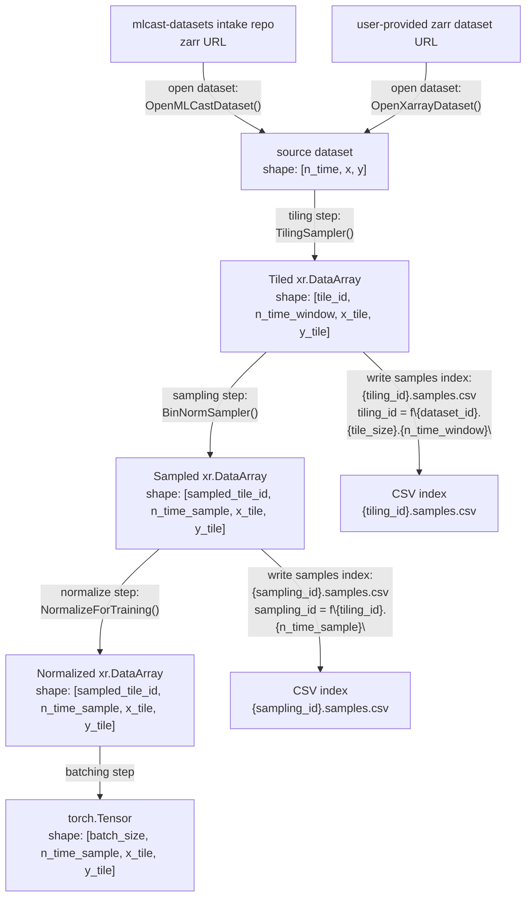

# Training Pipeline



```python
import torch
from torchdata.datapipes.iter import Mapper
from torch.utils.data import DataLoader

# Replace this import path with the actual package/module in your codebase.
from mlcast.datapipes import OpenXarrayDataset, TilingSampler, BinNormSampler

zarr_url = "mlcast-datasetes:/dmi/5min.zarr"

# [n_time, x, y]
source_dp = OpenXarrayDataset(zarr_url)

# Define pipeline operations first.
operations = [
    MLCastCatalogDataset(
        "dmi.precipitation.5min", var_name="rainrate"
    ),
    TilingSampler(
        n_time_window=12,
        tile_size=(128, 128),
    ),
    BinNormSampler(
        n_scalar_total_bins=10,
    ),
    ToTorchTensor()
]

# Apply operations in order:
# source -> tiled -> sampled
pipeline_dp = source_dp
for op in operations:
    pipeline_dp = op(pipeline_dp)

# batching step -> torch.Tensor
batched_tensor_dp = Mapper(pipeline_dp.batch(32), fn=lambda batch: torch.stack(list(batch), dim=0))

# Create a PyTorch DataLoader from the DataPipe.
loader = DataLoader(batched_tensor_dp, batch_size=None, num_workers=0)

batch = next(iter(loader))
assert isinstance(batch, torch.Tensor)
```

## Transformer Class Placeholders

```python

import xarray as xr


class TilingSampler:
    def __init__(self, n_time_window: int, tile_size: tuple[int, int]) -> None:
        self.n_time_window = n_time_window
        self.tile_size = tile_size

    def fit(self, da: xr.DataArray) -> "TilingSampler":
        """
        Compute tile indices from source dataset and write to:
        csv_path = f"{tiling_id}.samples.csv", where
        tiling_id = f"{da.attrs['dataset_id']}.{self.tile_size}.{self.n_time_window}".
        da shape: [n_time, x, y]
        """
        # Example CSV columns: tile_id,time_start,x_start,y_start,n_time_window,x_tile,y_tile
        raise NotImplementedError
        return self

    def transform(self, da: xr.DataArray) -> xr.DataArray:
        """
        Build tiled output by reading:
        csv_path = f"{tiling_id}.samples.csv", derived from da.attrs['dataset_id'].
        If CSV does not exist yet, call self.fit(da) first.
        output shape: [tile_id, n_time_window, x_tile, y_tile]
        """
        raise NotImplementedError


class BinNormSampler:
    def __init__(self, aggregation_method: str, n_scalar_bins: int) -> None:
        self.aggregation_method = aggregation_method
        self.n_scalar_bins = n_scalar_bins

    def fit(self, tiled: xr.DataArray) -> "BinNormSampler":
        """
        Compute sampling/binning indices and write to:
        csv_path = f"{sampling_id}.samples.csv", where
        sampling_id = f"{tiled.attrs['tiling_id']}.{self.aggregation_method}.{self.n_scalar_bins}".
        tiled shape: [tile_id, n_time_window, x_tile, y_tile]
        """
        # Example CSV columns: sampled_tile_id,source_tile_id,scalar_value,bin_id
        raise NotImplementedError
        return self

    def transform(self, tiled: xr.DataArray) -> xr.DataArray:
        """
        Build sampled output by reading:
        csv_path = f"{sampling_id}.samples.csv", derived from tiled.attrs['tiling_id'].
        If CSV does not exist yet, call self.fit(tiled) first.
        output shape: [sampled_tile_id, n_time_sample, x_tile, y_tile]
        """
        raise NotImplementedError


class NormalizeForTraining:
    def fit(self, sampled: xr.DataArray) -> "NormalizeForTraining":
        """
        Compute normalization statistics and write to:
        stats_csv_path = f"{sampled.attrs['sampling_id']}.stats.csv".
        sampled shape: [sampled_tile_id, n_time_sample, x_tile, y_tile]
        """
        # Example CSV columns: variable,mean,std
        raise NotImplementedError
        return self

    def transform(self, sampled: xr.DataArray) -> xr.DataArray:
        """
        Normalize sampled data using:
        stats_csv_path = f"{sampled.attrs['sampling_id']}.stats.csv".
        If CSV does not exist yet, call self.fit(sampled) first.
        output shape: [sampled_tile_id, n_time_sample, x_tile, y_tile]
        """
        raise NotImplementedError
```
