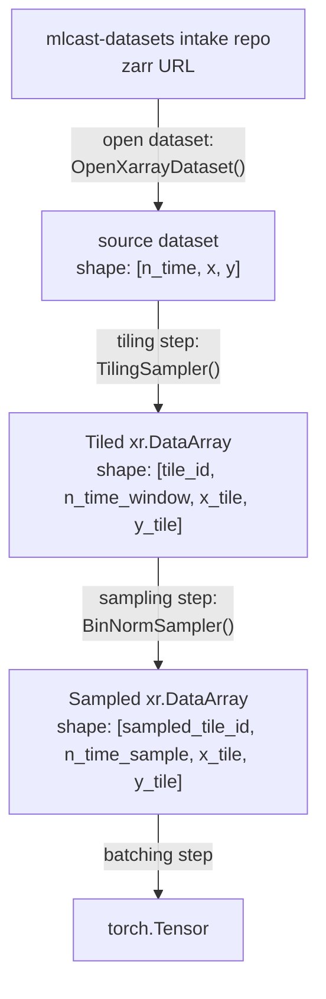

# Training Pipeline



```python
import torch
from torchdata.datapipes.iter import Mapper
from torch.utils.data import DataLoader

# Replace this import path with the actual package/module in your codebase.
from mlcast.datapipes import OpenXarrayDataset, TilingSampler, BinNormSampler

zarr_url = "mlcast-datasetes:/dmi/5min.zarr"

# [n_time, x, y]
source_dp = OpenXarrayDataset(zarr_url)

# Define pipeline operations first.
operations = [
    TilingSampler(
        n_time_window=12,
        tile_size=(128, 128),
    ),
    BinNormSampler(
        n_time_sample=6,
    ),
]

# Apply operations in order:
# source -> tiled -> sampled
pipeline_dp = source_dp
for op in operations:
    pipeline_dp = op(pipeline_dp)

# batching step -> torch.Tensor
batched_tensor_dp = Mapper(pipeline_dp.batch(32), fn=lambda batch: torch.stack(list(batch), dim=0))

# Create a PyTorch DataLoader from the DataPipe.
loader = DataLoader(batched_tensor_dp, batch_size=None, num_workers=0)

batch = next(iter(loader))
assert isinstance(batch, torch.Tensor)
```
