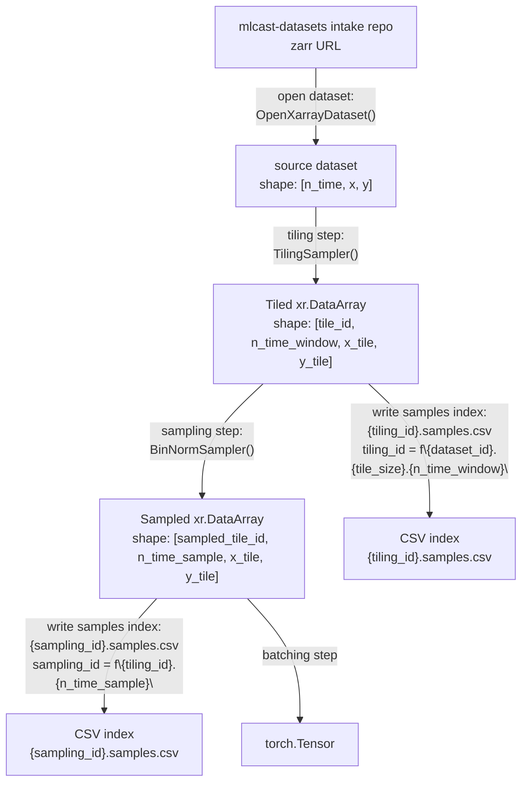

# Training Pipeline



```python
import torch
from torchdata.datapipes.iter import Mapper
from torch.utils.data import DataLoader

# Replace this import path with the actual package/module in your codebase.
from mlcast.datapipes import OpenXarrayDataset, TilingSampler, BinNormSampler

zarr_url = "mlcast-datasetes:/dmi/5min.zarr"

# [n_time, x, y]
source_dp = OpenXarrayDataset(zarr_url)

# Define pipeline operations first.
operations = [
    TilingSampler(
        n_time_window=12,
        tile_size=(128, 128),
    ),
    BinNormSampler(
        n_time_sample=6,
    ),
]

# Apply operations in order:
# source -> tiled -> sampled
pipeline_dp = source_dp
for op in operations:
    pipeline_dp = op(pipeline_dp)

# batching step -> torch.Tensor
batched_tensor_dp = Mapper(pipeline_dp.batch(32), fn=lambda batch: torch.stack(list(batch), dim=0))

# Create a PyTorch DataLoader from the DataPipe.
loader = DataLoader(batched_tensor_dp, batch_size=None, num_workers=0)

batch = next(iter(loader))
assert isinstance(batch, torch.Tensor)
```

## Sampler Signatures

```python
def TilingSampler(source: "xr.DataArray", n_time_window: int, tile_size: tuple[int, int]) -> "xr.DataArray":
    """
    Tile a source dataset into fixed-size spatial tiles and time windows.

    Args:
        source: Input array with shape [n_time, x, y].
        n_time_window: Number of timesteps per tile window.
        tile_size: Spatial tile size as (x_tile, y_tile).

    Returns:
        xr.DataArray with shape [tile_id, n_time_window, x_tile, y_tile].
    """
    raise NotImplementedError


def BinNormSampler(tiled: "xr.DataArray", n_time_sample: int) -> "xr.DataArray":
    """
    Sample tiled windows into normalized training samples.

    Args:
        tiled: Input array with shape [tile_id, n_time_window, x_tile, y_tile].
        n_time_sample: Number of timesteps per sampled sequence.

    Returns:
        xr.DataArray with shape [sampled_tile_id, n_time_sample, x_tile, y_tile].
    """
    raise NotImplementedError
```
